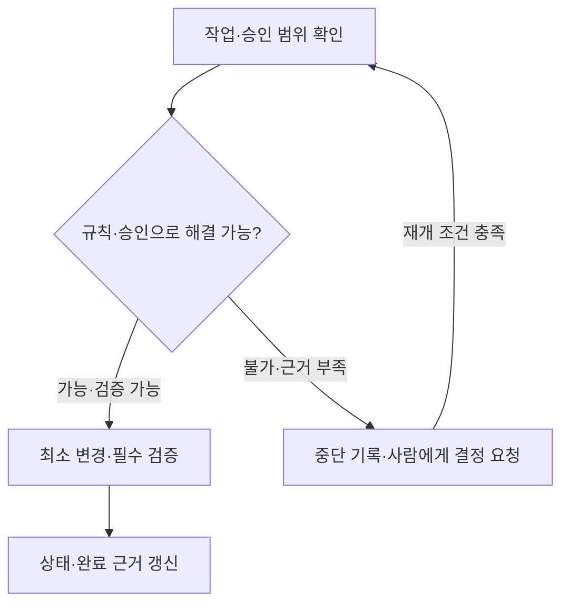

# 서로 다른 AI 모델의 판단 차이를 줄이기 위한 협업 문서 설계

여러 AI 도구를 번갈아 사용하거나 작업 세션이 바뀌어도 같은 요구사항과 기준을 유지할 수 있도록, 개발 규칙과 작업 상태를 Markdown으로 관리하는 구조를 설계했다. 공통 규칙, 표준 이름, 승인 범위, 검증 근거를 파일에 명시하고 다음 작업자가 이어서 확인하도록 구성했다.

현재 완성한 범위는 **협업 규칙·기록 양식·현황 문서**다. 실제 제품 기능이나 기술 스택은 확정하지 않았으며, 서로 다른 모델을 대상으로 한 비교 실험도 아직 수행하지 않았다. 이 문서는 설계 의도와 구현한 문서 구조를 설명한다.

## 해결하려는 문제

AI에게 개발을 요청할 때 작업 기준을 대화와 기억에만 맡기면, 다음 작업에서 무엇을 그대로 유지해야 하는지 확인하기 어렵다고 판단했다. 특히 다음 상황을 관리 대상으로 정했다.

| 상황 | 관리해야 할 차이 |
| --- | --- |
| 요구사항이 아직 정해지지 않음 | 한 AI의 제안이 다음 작업에서 확정 요구사항으로 취급되는 문제 |
| 같은 개념을 여러 곳에서 사용 | 변수명·타입·단위·빈 값의 의미를 다르게 해석하는 문제 |
| 기존 코드와 문서가 충돌 | 임의로 한쪽을 선택하거나 승인 범위를 넘어 수정하는 문제 |
| 작업 중단 후 다른 AI가 이어받음 | 진행 위치·남은 변경·중단 이유를 다시 추측하는 문제 |
| 코드 작성이 끝남 | 검증·사람 확인·통합·배포까지 완료됐다고 해석하는 문제 |

여기서 목표로 하는 일관성은 **허용되는 변경, 이름과 계약, 중단 조건, 완료 근거를 같은 기준으로 판단하는 것**이다. 모델의 내부 추론 과정은 수집하지 않고, 확인 가능한 입력·판단 근거·행동·결과를 공유한다.

## 문서 구성

파일은 프로젝트 루트에 두는 기준으로 연결했다. AI가 기본으로 읽는 문서는 핵심 규칙과 현재 작업 현황이며, 나머지는 작업 종류에 따라 읽는다.

| 문서 | 역할 | 읽는 시점 |
| --- | --- | --- |
| [AI_RULES.md](AI_RULES.md) | 필수 행동, 승인·중단·완료 조건. 현재 55줄 | 작업 시작 |
| [CURRENT_STATE.md](docs/CURRENT_STATE.md) | 현재 작업, 상태, 필요한 파일, 최신 로그 | 작업 시작·재개 |
| [NAMING.md](docs/NAMING.md) · [TERMS.md](docs/TERMS.md) | 이름 표기 규칙과 승인된 공용 개념 | 이름 생성·변경 |
| [DECISIONS.md](docs/DECISIONS.md) | 사람의 승인 근거·범위·조건 | 승인 판단 |
| [FEATURE_STATUS.md](docs/FEATURE_STATUS.md) · [기능 양식](docs/features/_TEMPLATE.md) | 기능별 구현·작업·검증 상태와 완료 기준 | 기능 작업 |
| [작업 기록 양식](docs/worklogs/_TEMPLATE.md) | 작업자·시간·변경·오류·재개·완료 근거 | 기록 생성·작업 인계 |
| [PROJECT_CONTEXT.md](PROJECT_CONTEXT.md) | 세부 운영 규칙 | 보충 설명 필요 시 |
| [README_AI.md](README_AI.md) | 작업 입력과 사용 방법 | 최초 적용 |

이 설계 설명 문서는 사람이 읽는 포트폴리오 자료로 두었다. AI의 매 작업 필독 대상에는 포함하지 않는다.

## 중요한 설계 선택

### 1. 규칙을 조건과 행동으로 명시

“주의해서 수정한다”처럼 해석 여지가 큰 표현을 줄이고, 어떤 조건에서 수정·중단·승인을 선택해야 하는지 적었다. 중요한 승인·중단 조건은 핵심 규칙 안에 직접 넣어 상세 문서의 특정 절을 찾아야만 알 수 있는 구조를 피했다.

충돌을 자동으로 수정하려면 기존 규칙과 승인으로 해결 방법이 분명하고, 계약과 다른 작업자의 변경을 보존하며, 검증할 수 있어야 한다. 이 조건을 충족하지 못하면 영향을 받는 구현을 멈추고 사람이 판단할 근거를 준비하도록 했다.



### 2. 확정·관찰·제안·미확인을 구분

요구사항이 미정인 상태에서 AI가 기능이나 API 계약을 만들어 확정하지 않도록 했다. 사람의 결정, 코드에서 관찰한 사실, 제안, 미확인 정보를 구분하고 근거를 남긴다. 모르는 값은 `null`이나 `UNVERIFIED`로 유지한다.

빈 기능 목록은 “아직 등록한 항목이 없음”을 뜻한다. 실제 구현된 기능이 전혀 없다는 결론으로 사용하지 않는다. 현재 패키지에도 가상의 제품 기능이나 기술 스택을 채워 넣지 않았다.

### 3. 같은 개념의 이름과 의미를 공유

공용 용어에는 표준명뿐 아니라 정의, 타입, 단위, 빈 값의 의미, API·DB 매핑과 승인 근거를 기록하도록 했다. 언어별 표기 방식은 적용하되 의미와 외부 계약은 유지한다.

기존 승인 개념에서 파생된 지역 변수의 표기와, 공용 개념·계약의 이름을 바꾸는 작업을 구분했다. 새 공용 이름이나 공용 이름 변경에는 사람의 승인을 요구한다.

### 4. 구현 상태와 작업 상태를 분리

하나의 “진행 중” 표시로 표현하기 어려운 상황을 별도 필드로 관리한다.

| 필드 | 확인하는 내용 | 상태 조합의 예 |
| --- | --- | --- |
| `implementation_status` | 어느 구현 단계인가 | `IMPLEMENTING`: 구현 중 |
| `work_status` | 지금 작업할 수 있는가 | `WAITING_APPROVAL`: 승인 대기 |
| `verification_status` | 필수 검증을 실행했는가 | `NOT_RUN`: 아직 미실행 |
| `review_status` | 사람이 검토했는가 | `PENDING`: 검토 대기 |
| `integration_status` | 변경이 통합됐는가 | `BRANCH_ONLY`: 작업 브랜치에만 존재 |
| `deployment_status` | 배포됐는가 | `NOT_DEPLOYED`: 미배포 |

예를 들어 `IMPLEMENTING + WAITING_APPROVAL`은 구현 도중 사람의 결정을 기다리는 상태다. 중단됐다고 구현 단계를 처음으로 되돌리지 않는다. 진행도는 승인된 완료 기준 중 현재 검증 근거가 있는 항목 수로 계산하고, 임의의 진행률을 쓰지 않도록 했다.

### 5. 작업 기록을 인수인계의 근거로 사용

작업·작업자·세션별로 로그를 만들고 시작, 중단, 재개, 검증, 완료 사건을 추가한다. 최신 요약은 갱신하지만 과거 사건은 보존하며, 틀린 기록은 정정 사건으로 남긴다.

중단 기록에는 적용 규칙의 ID와 원문, 정확한 위치, 실제 오류, 예상 위험, 보존한 변경, 필요한 결정, 재개 조건을 포함한다. 완료 기록에는 완료한 범위와 검증 결과에 더해 **출발 파일·심볼 → 도착 파일·심볼, 전달 값·계약, 확인 근거**를 남기도록 했다.

### 6. AI용 고정 형식과 한국어 설명을 함께 사용

YAML 키와 상태 코드는 같은 형식으로 유지하고, 사람이 검토하는 제목·요약·오류 설명·영향·승인 요청·인수인계는 한국어로 작성한다. 영어 오류 원문과 코드·명령어는 보존하고 한국어 설명을 덧붙인다.

아래는 일부 필드만 보여주는 **형식 예시**이며 실제 작업 기록이 아니다.

```yaml
template: true
summary_ko: "구현 중 API 응답 필드 변경이 필요해 승인을 기다리고 있다."
implementation_status: IMPLEMENTING
work_status: WAITING_APPROVAL
stop:
  category: APPROVAL_GAP
  observed_error:
    message: null
    summary_ko: "실행 오류는 관찰하지 않았다. API 계약 변경 승인 여부가 미확정이다."
  decision_request:
    question: "기존 응답 필드의 이름 변경을 승인할 수 있는가?"
  resume_when:
    - "변경 범위와 호환성 처리 방식에 대한 사람의 승인을 확인한다."
```

### 7. 읽기 범위와 모델 사용의 한계를 명시

핵심 규칙은 30~60줄 범위를 유지하고, 전체 과거 로그를 매번 읽지 않도록 했다. 작업 재개 시에는 세션 요약, 최신 사건, 해결되지 않은 중단 사건을 확인한다. 반복 입력을 줄이는 구조를 설계했으며 실제 토큰 절감량은 아직 측정하지 않았다.

중요한 해석·설계·충돌 판단에는 사용 가능한 상위 모델을 우선하도록 규정했다. 실제 모델을 확인하지 못하면 미확인으로 기록하고, 모델의 답변이 사람의 승인이나 검증 결과를 대신하지 않도록 했다. Markdown 자체가 모델을 전환하거나 권한을 강제하지는 않는다.

## 현재까지 준비한 범위와 확인 방법

| 구분 | 현재 상태 |
| --- | --- |
| 공통 판단 규칙·명명·승인·상태 구조 | 문서와 양식 작성 |
| 한국어 작업·오류·완료 기록 | 출력 규칙과 `summary_ko` 필드 반영 |
| 문서 형식 확인 | YAML 문법·고정 상태값·필드·파일 연결·과거 로그 보존 점검 |
| 제품 기능 적용 | 제품 요구사항·저장소·기술 스택 미확정 또는 미제공 |
| 여러 모델의 동일 과제 비교 | 미실시 |
| 판단 일치율·오류율·토큰 비용 개선 | 미측정 |

문서 작성과 정적 검증으로 확인한 것은 **규칙과 기록 형식의 준비 상태**다. 모델 간 판단 차이가 실제로 얼마나 줄었는지는 별도의 비교 실험으로 확인해야 한다.

## 향후 검증 계획

동일한 코드 기준과 승인 범위에서 여러 모델이 같은 과제를 수행하도록 하고, 공통 문서 적용 전후를 비교할 계획이다. 모델 식별자, 설정, 입력, 코드 버전, 실행 도구와 반복 횟수를 기록해 비교 조건을 명확히 해야 한다.

| 평가 항목 | 확인 방법 |
| --- | --- |
| 승인·중단 판단의 적절성 | 사람이 정한 판단 기준과 각 실행의 행동을 비교 |
| 이름·계약 준수 | 승인된 표준명과 기존 계약에서 벗어난 변경 확인 |
| 작업 인계의 완전성 | 필요한 로그 필드·중단 이유·재개 조건 누락 확인 |
| 완료 판단의 근거 | 완료 표시와 실제 검증·사람 검토 근거 대조 |
| 입력 비용 | 동일 과제의 실제 입력 토큰·반복 읽기 양 비교 |

모델들이 같은 잘못된 결정을 내릴 수도 있으므로 모델 간 일치율만으로 품질을 평가하지 않는다. 사람의 기준과 실제 검증 결과를 함께 확인한다.

## 포트폴리오 소개 문장

서로 다른 AI 모델과 작업 세션에서 개발 기준을 유지하기 위해 공통 규칙, 표준 이름, 승인 범위, 기능 상태, 작업 이력을 Markdown과 YAML로 구조화했다. 조건별 행동과 중단 기준을 명시하고, 한국어 작업 기록과 파일 간 연결 근거를 통해 사람이 변경 내용을 검토하고 다음 작업자가 이어받을 수 있도록 설계했다.
